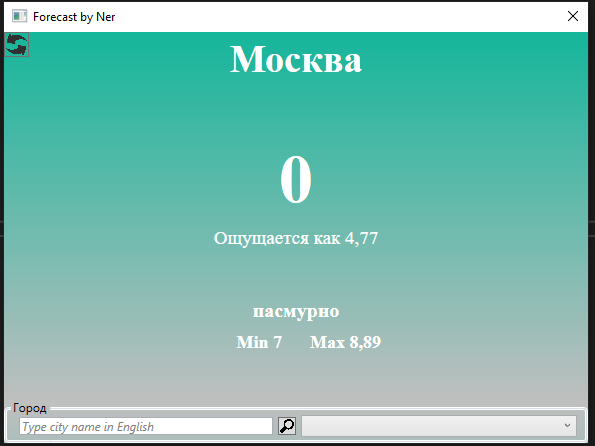
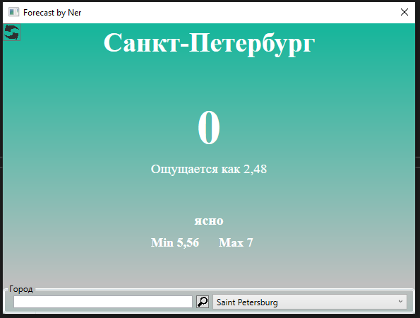
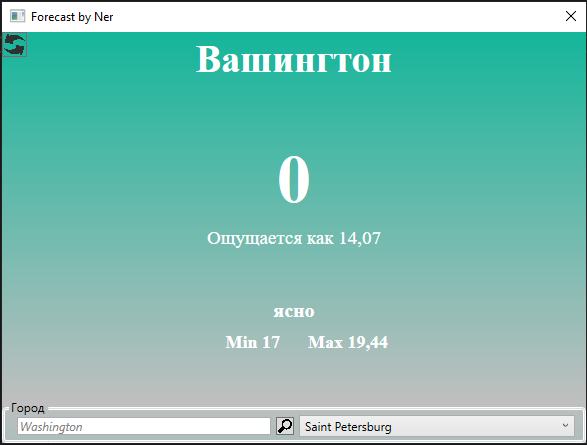

# MyWeather
This desktop app will let you check weather in your city

# How does it work?
Everything is simple, all you need to do is type the name of city which weather you want to know.
Btw, be careful with misspelling.
Or you could try to use one of the city, represented in combobox.

# Examples

